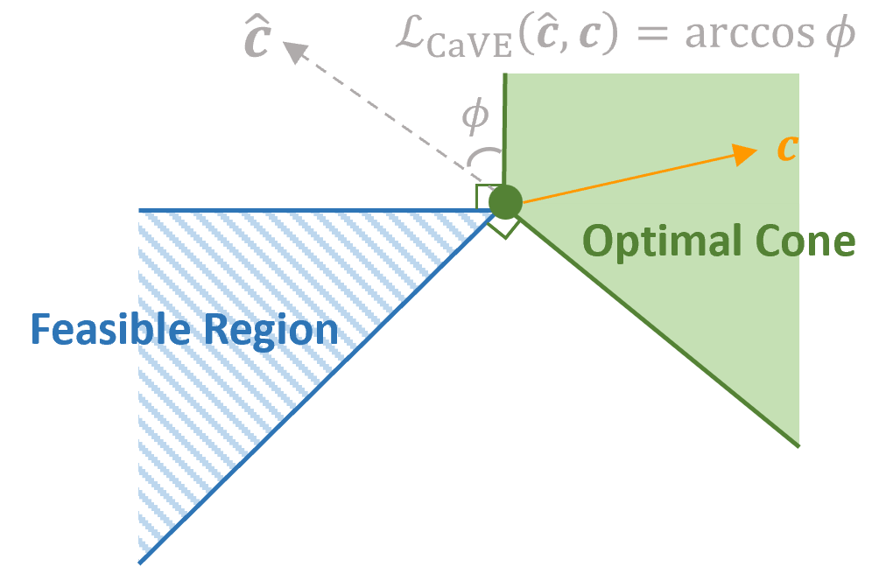

# CaVE: Cone-Aligned Vector Estimation

<p align="center"></p>

## Publication

This repository is the implementation of our paper: [CaVE: A Cone-Aligned Approach for Fast Predict-then-optimize with Binary Linear Programs](https://arxiv.org/abs/2312.07718).

Citation:
```
@misc{tang2023cave,
      title={CaVE: A Cone-Aligned Approach for Fast Predict-then-optimize with Binary Linear Programs}, 
      author={Bo Tang and Elias B. Khalil},
      year={2023},
      eprint={2312.07718},
      archivePrefix={arXiv}
}
```

## Introduction

**CaVE** (**Cone-aligned Vector Estimation**) is a cutting-edge machine learning methodology designed for the efficient and accurate solution of **predict-then-optimize** tasks within the domain of operations research. This innovative approach integrates predictive modeling with optimization algorithms, focusing on **Binary Linear Programming** (**BLP**) problems.

## Key Features

- **End-to-End Training:** CaVE seamlessly integrates learning and optimization, delivering state-of-the-art performance in predicting cost coefficients for optimization problems.
- **Innovative Alignment Strategy:** By aligning predicted cost vectors within a cone, CaVE simplifies the original problem into more manageable quadratic programming.
- **Versatility and Scalability:** Exceptionally robust in managing large-scale optimization challenges, CaVE is adaptable to various problem sizes and complexities.
- **Efficiency in Computation:** Markedly improves computational efficiency, streamlining the more time-consuming end-to-end predict-then-optimize approaches.

## Dependencies

The project depends on the following packages. The listed versions are used for our experiments, but other versions may also work:

* [NumPy](https://numpy.org/) 1.25.2
* [SciPy](https://scipy.org/) 1.11.2
* [Pathos](https://pathos.readthedocs.io/)  0.3.1
* [tqdm](https://tqdm.github.io/) 4.66.1
* [CVXPY](https://www.cvxpy.org/) 1.3.2
* [Clarabel](https://oxfordcontrol.github.io/ClarabelDocs) 0.6.0
* [Gurobi](https://www.gurobi.com/) 10.0.3
* [PyTorch](http://pytorch.org/) 2.0.1
* [PyEPO](https://github.com/khalil-research/PyEPO) 0.3.6

## Download

You can download **CaVE** from our GitHub repository.

```bash
git clone -b main --depth 1 https://github.com/khalil-research/CaVE.git
```

## CaVE Loss Modules

### exactConeAlignedCosine

The ``exactConeAlignedCosine`` class is an autograd module for computing the **CaVE Exact** loss.

#### Parameters

- `optmodel` (`optModel`): An instance of the PyEPO optimization model.
- `solver` (`str`, optional): The QP solver finds the projection. Options include `'clarabel'` and `'nnls'`. The Default is `'clarabel'`.
- `reduction` (`str`, optional): The reduction to apply to the output. Options include `'mean'`, `'sum'`, and `'none'`. The default is `'mean'`.
- `processes` (`int`, optional): Number of processors. `1` is for single-core, and `0` is for using all cores. The default is `1`.

### innerConeAlignedCosine

The ``innerConeAlignedCosine`` class is an autograd module for computing the **CaVE+** (`solve_ratio` = 1) and **CaVE Hybrid** (`solve_ratio` < 1) loss.

#### Parameters

- `optmodel` (`optModel`): An instance of the PyEPO optimization model.
- `solver` (`str`, optional): The QP solver finds the projection. Options include `'clarabel'` and `'nnls'`. The Default is `'clarabel'`.
- `max_iter` (`int`, optional): The maximum number of iterations for solving the QP during training. The default is `3`.
- `solve_ratio` (`float`, optional): The ratio of solving QP during training. Ranges from `0` to `1`. The default is `1`.
- `inner_ratio` (`float`, optional): The ratio to push the projection inside. Ranges from `0` to `1`. The default is `0.2`.
- `reduction` (`str`, optional): The reduction to apply to the output. Options include `'mean'`, `'sum'`, and `'none'`. The default is `'mean'`.
- `processes` (`int`, optional): Number of processors. `1` is for single-core, and `0` is for using all cores. The default is `1`.

## Sample Code

```python
#!/usr/bin/env python
# coding: utf-8

import numpy as np
import torch
from torch import nn
from torch.utils.data import DataLoader
import pyepo

from src.model import tspDFJModel
from src.dataset import optDatasetConstrs, collate_fn
from src.cave import innerConeAlignedCosine

# generate data
num_node = 20 # node size
num_data = 100 # number of training data
num_feat = 10 # size of feature
poly_deg = 4 # polynomial degree
noise = 0.5 # noise width
feats, costs = pyepo.data.tsp.genData(num_data, num_feat, num_node, poly_deg, noise, seed=42)

# build predictor
class linearRegression(nn.Module):

    def __init__(self):
        super(linearRegression, self).__init__()
        self.linear = nn.Linear(num_feat, num_node*(num_node-1)//2)

    def forward(self, x):
        out = self.linear(x)
        return out
reg = linearRegression()

# set solver
optmodel = tspDFJModel(num_node)

# get dataset
dataset = optDatasetConstrs(optmodel, feats, costs)
# get data loader
dataloader = DataLoader(dataset, batch_size=32, collate_fn=collate_fn, shuffle=True)

# init loss
cave = innerConeAlignedCosine(optmodel, solver="clarabel", processes=1)
# set optimizer
optimizer = torch.optim.Adam(reg.parameters(), lr=1e-2)

# training
num_epochs = 10
for epoch in range(num_epochs):
    for data in dataloader:
        # unzip data: only need features and binding constraints
        x, _, _, bctr = data
        # predict cost
        cp = reg(x)
        # cave loss
        loss = cave(cp, bctr)
        # backward pass
        optimizer.zero_grad()
        loss.backward()
        optimizer.step()
        print("Epoch {:4.0f}, Loss: {:8.4f}".format(epoch, loss.item()))

```

## Running the Tests

```
python run_test.py
```

## License

This project is licensed under the MIT License - see the [LICENSE file](https://github.com/khalil-research/CaVE/blob/main/LICENSE) for details.
