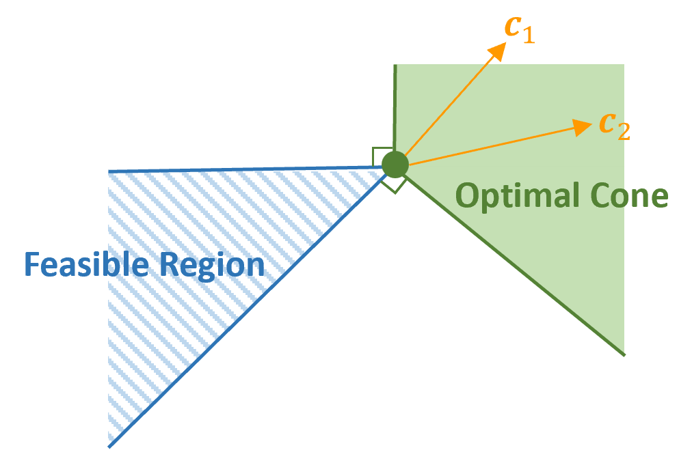

# CaVE: Cone-Aligned Vector Estimation

<p align="center"></p>

## Publication

This repository is the implementation of our paper. CaVE: A Cone-Aligned Approach for Fast Predict-then-optimize with Binary Linear Programs.

## Introduction

**CaVE** (**Cone-aligned Vector Estimation**) is a cutting-edge machine learning methodology designed for the efficient and accurate solution of **predict-then-optimize** tasks within the domain of operations research. This innovative approach integrates predictive modeling with optimization algorithms, focusing on **Binary Linear Programming** (**BLP**) problems.

## Key Features

- **End-to-End Training:** CaVE seamlessly integrates learning and optimization, delivering state-of-the-art performance in predicting cost coefficients for optimization problems.
- **Innovative Alignment Strategy:** By aligning predicted cost vectors within a cone, CaVE simplifies the original problem into more manageable quadratic programming.
- **Versatility and Scalability:** Exceptionally robust in managing large-scale optimization challenges, CaVE is adaptable to various problem sizes and complexities.
- **Efficiency in Computation:** Markedly improves computational efficiency, streamlining the traditionally more time-consuming and complex end-to-end predict-then-optimize approaches.

## Dependencies

* [NumPy](https://numpy.org/)
* [SciPy](https://scipy.org/)
* [Pathos](https://pathos.readthedocs.io/)
* [tqdm](https://tqdm.github.io/)
* [CVXPY](https://www.cvxpy.org/)
* [Clarabel](https://oxfordcontrol.github.io/ClarabelDocs)
* [Gurobi](https://www.gurobi.com/)
* [PyTorch](http://pytorch.org/)
* [PyEPO](https://github.com/khalil-research/PyEPO)

## Sample Code

```python
#!/usr/bin/env python
# coding: utf-8

import numpy as np
import torch
from torch import nn
from torch.utils.data import DataLoader
import pyepo

from src.model import tspDFJModel
from src.dataset import optDatasetConstrs, collate_fn
from src.cave import innerConeAlignedCosine

# generate data
num_node = 20 # node size
num_data = 100 # number of training data
num_feat = 10 # size of feature
poly_deg = 4 # polynomial degree
noise = 0.5 # noise width
feats, costs = pyepo.data.tsp.genData(num_data, num_feat, num_node, poly_deg, noise, seed=42)

# build predictor
class linearRegression(nn.Module):

    def __init__(self):
        super(linearRegression, self).__init__()
        self.linear = nn.Linear(num_feat, num_node*(num_node-1)//2)

    def forward(self, x):
        out = self.linear(x)
        return out
reg = linearRegression()

# set solver
optmodel = tspDFJModel(num_node)

# get dataset
dataset = optDatasetConstrs(optmodel, feats, costs)
# get data loader
dataloader = DataLoader(dataset, batch_size=32, collate_fn=collate_fn, shuffle=True)

# init loss
cave = innerConeAlignedCosine(optmodel, solver="clarabel", processes=1)
# set optimizer
optimizer = torch.optim.Adam(reg.parameters(), lr=1e-2)

# training
num_epochs = 10
for epoch in range(num_epochs):
    for data in dataloader:
        # unzip data: only need features and binding constraints
        x, _, _, bctr = data
        # predict cost
        cp = reg(x)
        # cave loss
        loss = cave(cp, bctr)
        # backward pass
        optimizer.zero_grad()
        loss.backward()
        optimizer.step()
        print("Epoch {:4.0f}, Loss: {:8.4f}".format(epoch, loss.item()))

```
