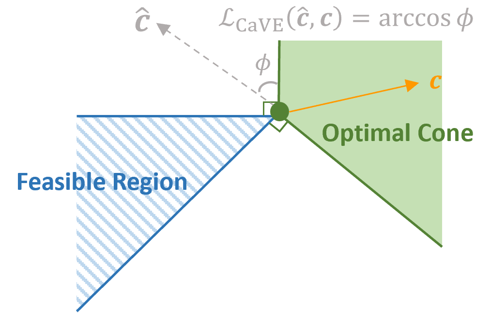

# CaVE: Cone-Aligned Vector Estimation

<p align="center"></p>

## Publication

This repository is the implementation of our paper: [CaVE: A Cone-Aligned Approach for Fast Predict-then-optimize with Binary Linear Programs](https://link.springer.com/chapter/10.1007/978-3-031-60599-4_12).

Citation:
```
@inproceedings{tang2024cave,
  title={CaVE: A Cone-Aligned Approach for Fast Predict-then-optimize with Binary Linear Programs},
  author={Tang, Bo and Khalil, Elias B},
  booktitle={International Conference on the Integration of Constraint Programming, Artificial Intelligence, and Operations Research},
  pages={193--210},
  year={2024},
  organization={Springer}
}
```

## Talk Slides

There is a talk on our paper at the CPAIOR 2024 conference. You can view the slides of the talk [here](https://github.com/khalil-research/CaVE/blob/main/slides/CaVE.pdf).

## Introduction

**CaVE** (**Cone-aligned Vector Estimation**) is an efficient and accurate **Decision-focused Learning** / **End-to-end Predict-then-optimize** approach for **Binary Linear Programs** (BLPs).

## Key Features

- **End-to-End:** The loss function of CaVE focuses on decision quality.
- **Efficiency:** The algorithm of CaVE utilizes non-negative least squares (NNLSs) instead of solving BLPs.

## What's New: Batched GPU APGD Solver

A new solver `'apgd'` (Nesterov-Accelerated Projected Gradient Descent) is now the **default backend**. It batches the cone projection across the entire batch as a single dense GPU operation via `torch.compile`, eliminating per-instance solver overhead.

### Speedup vs Clarabel (forward + backward, batch=32, RTX 5080)

| Problem shape | APGD GPU (new) | Clarabel CPU cached | NNLS CPU | Speedup vs Clarabel |
|---|---|---|---|---|
| n=28, m=56 (small) | **1.8 ms** | 34.5 ms | 20.2 ms | **19×** |
| n=45, m=66 (TSP-10) | **1.4 ms** | 53.1 ms | 27.4 ms | **36×** |
| n=91, m=121 (TSP-15) | **1.7 ms** | 613 ms | 100.9 ms | **365×** |

APGD throughput stays roughly constant with problem size while interior-point methods scale poorly.

The legacy `'clarabel'` and `'nnls'` solvers remain available for reproducibility — pass `solver='clarabel'` or `solver='nnls'` to either loss module.

## Dependencies

The project depends on the following packages. The listed versions are used for our experiments, but other versions may also work:

* [NumPy](https://numpy.org/) [1.25.2]
* [SciPy](https://scipy.org/) [1.11.2]
* [Pathos](https://pathos.readthedocs.io/) [0.3.1]
* [tqdm](https://tqdm.github.io/) [4.66.1]
* [CVXPY](https://www.cvxpy.org/) [1.3.2]
* [Clarabel](https://oxfordcontrol.github.io/ClarabelDocs) [0.6.0]
* [Gurobi](https://www.gurobi.com/) [10.0.3]
* [PyTorch](http://pytorch.org/) [2.0.1]
* [PyEPO](https://github.com/khalil-research/PyEPO) [0.3.5]

## Download

You can download **CaVE** from our GitHub repository.

```bash
git clone -b main --depth 1 https://github.com/khalil-research/CaVE.git
```

## CaVE Loss Modules

### exactConeAlignedCosine

The ``exactConeAlignedCosine`` class is an autograd module for computing the **CaVE Exact** loss.

#### Parameters

- `optmodel` (`optModel`): An instance of the PyEPO optimization model.
- `solver` (`str`, optional): The QP solver for the projection. Options include `'apgd'` (batched GPU APGD), `'clarabel'` (cvxpy) and `'nnls'` (scipy). The default is `'apgd'`.
- `solver_kwargs` (`dict`, optional): Backend-specific tuning passed through to the solver (e.g. `{'max_iters': 200, 'tol_grad': 1e-3}` for APGD). The default is `None` (use solver defaults).
- `reduction` (`str`, optional): The reduction to apply to the output. Options include `'mean'`, `'sum'`, and `'none'`. The default is `'mean'`.
- `processes` (`int`, optional): Number of processors. `1` is for single-core, and `0` is for using all cores. The default is `1`.

### innerConeAlignedCosine

The ``innerConeAlignedCosine`` class is an autograd module for computing the **CaVE+** (`solve_ratio` = 1) and **CaVE Hybrid** (`solve_ratio` < 1) loss.

#### Parameters

- `optmodel` (`optModel`): An instance of the PyEPO optimization model.
- `solver` (`str`, optional): The QP solver for the projection. Options include `'apgd'`, `'clarabel'` and `'nnls'`. The default is `'apgd'`.
- `solver_kwargs` (`dict`, optional): Backend-specific tuning. When `None` (default) and `solver='apgd'`, inner mode auto-injects `{'max_iters': 20, 'tol_grad': None}` for truncated APGD (lands inside the cone).
- `max_iter` (`int`, optional): The maximum Clarabel iterations for the inner-truncated projection. The default is `3`.
- `solve_ratio` (`float`, optional): The probability per batch of running the QP projection. Ranges from `0` to `1`. The default is `1`.
- `inner_ratio` (`float`, optional): The weight to push the heuristic projection inside. Ranges from `0` to `1`. The default is `0.2`.
- `reduction` (`str`, optional): The reduction to apply to the output. Options include `'mean'`, `'sum'`, and `'none'`. The default is `'mean'`.
- `processes` (`int`, optional): Number of processors. `1` is for single-core, and `0` is for using all cores. The default is `1`.
- `seed` (`int`, optional): Seed for the per-batch QP-vs-heuristic branch RNG. The default is `None`.

## Sample Code

```python
#!/usr/bin/env python
# coding: utf-8

import numpy as np
import torch
from torch import nn
from torch.utils.data import DataLoader
import pyepo

from src.model import tspDFJModel
from src.dataset import optDatasetConstrs, collate_fn
from src.cave import innerConeAlignedCosine

# generate data
num_node = 20  # node size
num_data = 100 # number of training data
num_feat = 10  # size of feature
poly_deg = 4   # polynomial degree
noise = 0.5    # noise width
feats, costs = pyepo.data.tsp.genData(num_data, num_feat, num_node, poly_deg, noise, seed=42)

# build predictor
class linearRegression(nn.Module):

    def __init__(self):
        super(linearRegression, self).__init__()
        self.linear = nn.Linear(num_feat, num_node*(num_node-1)//2)

    def forward(self, x):
        out = self.linear(x)
        return out

reg = linearRegression()

# set solver
optmodel = tspDFJModel(num_node)

# get dataset
dataset = optDatasetConstrs(optmodel, feats, costs)
# get data loader
dataloader = DataLoader(dataset, batch_size=32, collate_fn=collate_fn, shuffle=True)

# init loss (solver defaults to 'apgd' for batched GPU projection)
cave = innerConeAlignedCosine(optmodel, processes=1)
# set optimizer
optimizer = torch.optim.Adam(reg.parameters(), lr=1e-2)

# training
num_epochs = 10
for epoch in range(num_epochs):
    for data in dataloader:
        # unzip data: only need features and binding constraints
        x, _, _, _, bctr = data
        # predict cost
        cp = reg(x)
        # cave loss
        loss = cave(cp, bctr)
        # backward pass
        optimizer.zero_grad()
        loss.backward()
        optimizer.step()
        print("Epoch {:4.0f}, Loss: {:8.4f}".format(epoch, loss.item()))

```

## Running the Tests

```
python run_tests.py
```

## License

This project is licensed under the MIT License - see the [LICENSE file](https://github.com/khalil-research/CaVE/blob/main/LICENSE) for details.
